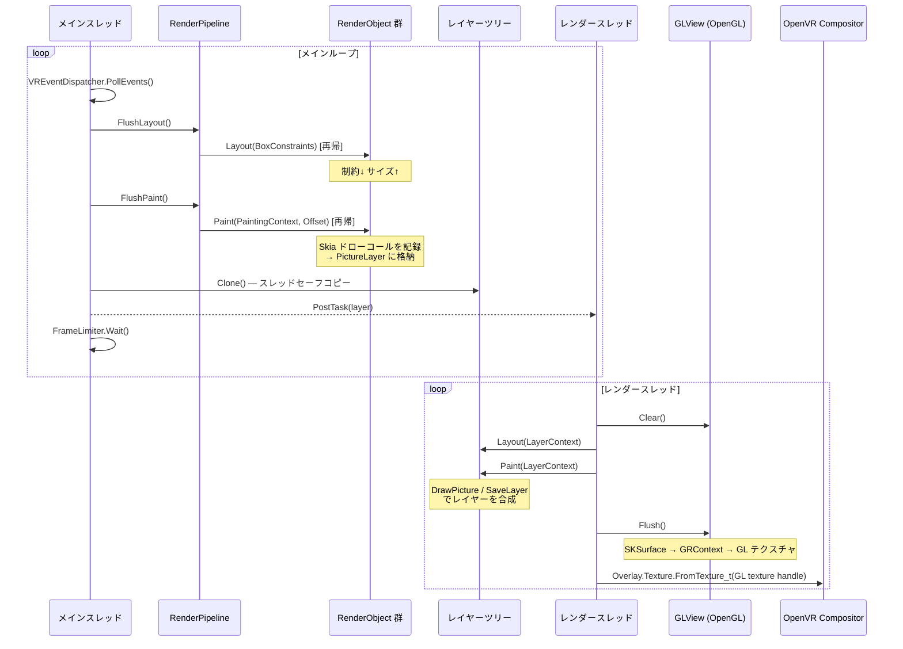

# FloatSoda: SteamVR Overlay UI Framework (v0.0.1)

**FloatSoda** は、SteamVR Overlay を **Flutter のような宣言的な書き心地** で作成できるように開発中の UI フレームワークです。SkiaSharp → OpenGL → OpenVR という経路でレンダリングし、複数のオーバーレイを統一的に管理できます。

---

## 特徴

- **Flutter-like な開発体験**: `StatelessWidget` による宣言的な UI 構築が可能です（`StatefulWidget` は WIP）
- **差分更新**: `BuildOwner` による Widget の差分ビルドと、dirty フラグによる RenderObject の差分レイアウト・差分ペイント
- **RenderObject ツリー**: Flutter の RenderObject に相当するレイアウト・描画ツリーを実装
- **複数オーバーレイ対応**: ダッシュボード・ワールド座標固定・デバイス追従を同時に管理
- **Skia による描画**: SkiaSharp を使用した高品質なレンダリング
- **スレッドセーフ**: メインスレッドとレンダースレッドをレイヤークローンで分離

---

## Getting Started

### 動作環境

- .NET 10 / C# 14
- SteamVR（起動済みであること）
- SkiaSharp / OpenTK / OpenVR

### サンプルアプリの起動

```bash
# SteamVR を起動してから実行する
dotnet run --project samples/FloatSoda.Samples.OverlayApp
```

SteamVR ダッシュボードにカラーボックスを表示するオーバーレイが起動します。

### 最小構成のコード

```csharp
using FloatSoda;
using FloatSoda.Widgets;
using FloatSoda.Widgets.Layout;
using FloatSoda.Widgets.Paint;
using SkiaSharp;

var builder = FloatSodaAppBuilder.CreateDefault();
using var app = builder.Build();

Widget root = new Align
{
    Child = new SizedBox
    {
        Width = 100,
        Height = 100,
        Child = new ColoredBox
        {
            Color = SKColors.Tomato
        }
    }
};

// ダッシュボードオーバーレイ（サイズは root のレイアウト結果に自動追従）
app.CreateWindow(new DashboardWindow { Title = "MyDashboard", Child = root });

// ワールド座標固定（メートル単位。Position 省略時は前方1m・高さ1m）
// app.CreateWindow(new WorldSpaceWindow { Title = "MyWorld", Child = root });

// デバイス追従
// app.CreateWindow(new DeviceTrackedWindow { Title = "MyHand", Child = root, Target = TrackedDevice.LeftController });

app.Run();
```

---

## レンダリングライフサイクル



> 詳細は [docs/Architecture.md](docs/Architecture.md) を参照。

---

## 実装済みの RenderObject

**レイアウト系**

| クラス | 説明 |
|---|---|
| `RenderView` | ルートノード。オーバーレイのサイズを定義 |
| `RenderPositionedBox` | 子を `Alignment` で配置（デフォルト: 中央） |
| `RenderFlex` | Row / Column 相当。`Axis`, `MainAxisAlignment`, `CrossAxisAlignment` を指定可 |
| `RenderConstrainedBox` | 子に `BoxConstraints` を付与してサイズを強制 |

**描画系**

| クラス | 説明 |
|---|---|
| `RenderColoredBox` | 矩形を指定色で塗りつぶす |
| `RenderImage` | `FileImageProvider` でロードした画像を描画 |

**クリップ系**

| クラス | 説明 |
|---|---|
| `RenderClipRect` | 矩形でクリップ |
| `RenderClipRoundRect` | 角丸矩形でクリップ（`BorderRadius` 指定可） |
| `RenderClipPath` | 任意の `SKPath` でクリップ（`CustomClipper<SKPath>` を渡す） |
| `RenderClipOval` | 楕円でクリップ |

---

## ドキュメント

入り口は **[docs/Home.md](docs/Home.md)** です(GitHub Wiki にも自動同期されます)。

| ドキュメント | 内容 |
|---|---|
| [docs/Home.md](docs/Home.md) | ドキュメントトップ・全体像・実装状況サマリ |
| [docs/GettingStarted.md](docs/GettingStarted.md) | クイックスタートガイド |
| [docs/Architecture.md](docs/Architecture.md) | アーキテクチャ概要・フレームパイプライン・スレッドモデル |
| [docs/WidgetSystem.md](docs/WidgetSystem.md) | ウィジェット/エレメントシステム |
| [docs/BuildPipeline.md](docs/BuildPipeline.md) | BuildOwner による Widget 差分更新の仕組み |
| [docs/RenderObjects.md](docs/RenderObjects.md) | RenderObject ツリーのリファレンス |
| [docs/OVRIntegration.md](docs/OVRIntegration.md) | OpenVR インテグレーションリファレンス |
| [docs/APIDesign.md](docs/APIDesign.md) | API 設計規約 |

---

## 開発ステータス (v0.0.1 Alpha)

本プロジェクトは現在 **概念実証（PoC）段階** です。API は予告なく変更されます。

- [x] RenderObject ツリー（レイアウト・描画・クリップ・画像・差分更新）
- [x] レイヤーツリー（ContainerLayer / PictureLayer / ClipLayer / OpacityLayer）
- [x] 複数オーバーレイ（ダッシュボード / ワールド座標 / デバイス追従）
- [x] Widget → RenderObject への inflate パイプライン（StatelessWidget）
- [x] BuildOwner による Widget 差分ビルド
- [ ] StatefulWidget / InheritedWidget / Key（スケルトンのみ）
- [ ] MultiChildRenderObjectElement の再ビルド（子リストの差分更新）
- [ ] SteamVR のイベント処理と宣言的な入力（ヒットテスト）
- [ ] アニメーションシステムの統合
- [ ] マニフェストファイルの自動生成（検討中）
