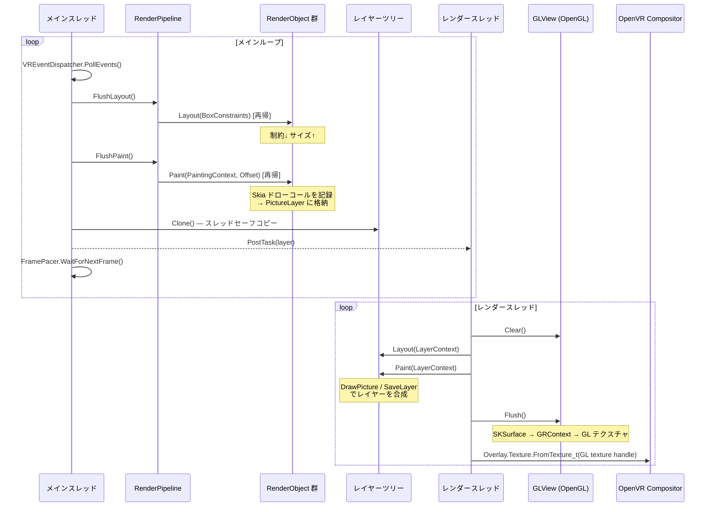

# FloatSoda: SteamVR Overlay UI Framework

[](https://www.nuget.org/packages/FloatSoda/)
[](https://www.nuget.org/packages/FloatSoda/)
[](https://github.com/sumx21t-3310/FloatSoda/actions/workflows/ci.yml)
[](LICENSE)

**FloatSoda** is a UI framework for building SteamVR overlays with a **Flutter-like declarative API** in C# / .NET. It renders via SkiaSharp → OpenGL → OpenVR, and manages multiple overlays (dashboard, world-space, and device-tracked) in a unified way. Currently in alpha — APIs may change without notice.

> 📖 The documentation below is in Japanese. See the [Wiki](https://github.com/sumx21t-3310/FloatSoda/wiki) for details, or check the [minimal example](#最小構成のコード) — the code speaks for itself.

**FloatSoda** は、SteamVR Overlay を **Flutter のような宣言的な書き心地** で作成できるように開発中の UI フレームワークです。SkiaSharp → OpenGL → OpenVR という経路でレンダリングし、複数のオーバーレイを統一的に管理できます。

---

## 特徴

- **Flutter-like な開発体験**: `StatelessWidget` / `StatefulWidget` による宣言的な UI 構築と `SetState()` による再ビルド
- **差分更新**: `BuildOwner` による Widget の差分ビルドと、dirty フラグによる RenderObject の差分レイアウト・差分ペイント
- **RenderObject ツリー**: Flutter の RenderObject に相当するレイアウト・描画ツリーを実装
- **複数オーバーレイ対応**: ダッシュボード・ワールド座標固定・デバイス追従を同時に管理
- **Skia による描画**: SkiaSharp を使用した高品質なレンダリング
- **スレッドセーフ**: メインスレッドとレンダースレッドをレイヤークローンで分離

---

## Getting Started

### 動作環境

- .NET 10 / C# 14
- SteamVR（起動済みであること）
- SkiaSharp / OpenTK / OpenVR

### サンプルアプリの起動

```bash
# SteamVR を起動してから実行する
dotnet run --project samples/FloatSoda.Samples.OverlayApp
```

SteamVR ダッシュボードにカラーボックスを表示するオーバーレイが起動します。

### 最小構成のコード

```csharp
using FloatSoda;
using FloatSoda.Widgets;
using FloatSoda.Widgets.Layout;
using FloatSoda.Widgets.Paint;
using Microsoft.Extensions.DependencyInjection;
using Microsoft.Extensions.Hosting;
using SkiaSharp;

var builder = Host.CreateApplicationBuilder(args);
builder.Services.AddFloatSoda();

using var host = builder.Build();
var app = host.Services.GetRequiredService<FloatSodaApp>();

Widget root = new Align
{
    Child = new SizedBox
    {
        Width = 100,
        Height = 100,
        Child = new ColoredBox
        {
            Color = SKColors.Tomato
        }
    }
};

// ダッシュボードオーバーレイ（サイズは root のレイアウト結果に自動追従）
app.CreateWindow(new DashboardWindow { Title = "MyDashboard", Child = root });

// ワールド座標固定（メートル単位。Position 省略時は前方1m・高さ1m）
// app.CreateWindow(new WorldSpaceWindow { Title = "MyWorld", Child = root });

// デバイス追従
// app.CreateWindow(new DeviceTrackedWindow { Title = "MyHand", Child = root, Target = TrackedDevice.LeftController });

await host.RunAsync();
```

---

## レンダリングライフサイクル



> 詳細は [docs/Architecture.md](docs/Architecture.md) を参照。

---

## 実装済みの Widget

**レイアウト系**

| クラス | 説明 |
|---|---|
| `Row` / `Column` / `Flex` | 子を水平・垂直に並べる。`MainAxisAlignment` / `CrossAxisAlignment` を指定可 |
| `Align` / `Center` | 子を `Alignment` で配置 |
| `SizedBox` | `Width` / `Height` で固定サイズを与える |
| `ConstrainedBox` | 子に `BoxConstraints` を付与してサイズを制約 |

**描画系**

| クラス | 説明 |
|---|---|
| `ColoredBox` | 矩形を指定色で塗りつぶす |
| `Image` | `FileImageProvider` でロードした画像を描画 |
| `Text` / `RichText` | テキストを描画（`Text` は `RichText` の簡易ラッパー） |
| `ClipRect` / `ClipRoundRect` / `ClipOval` | 矩形・角丸矩形・楕円でクリップ |
| `ClipCustomPath` | 任意の `SKPath` でクリップ（`CustomClipper<SKPath>` を渡す） |

**ウィンドウ系**

| クラス | 説明 |
|---|---|
| `DashboardWindow` | SteamVR ダッシュボードに表示するオーバーレイ |
| `WorldSpaceWindow` | ワールド座標に固定するオーバーレイ（メートル単位） |
| `DeviceTrackedWindow` | HMD・コントローラー等のデバイスに追従するオーバーレイ |

**自作 Widget の基底クラス**

- `StatelessWidget` — `Build()` をオーバーライドして UI を宣言
- `StatefulWidget<T>` + `State<T>` — `SetState()` で状態変更と再ビルド
- `InheritedWidget` — ツリー下方向へのコンテキスト伝播

> `Container` / `Padding` / `Opacity` / `ListView` / `GridView` / `Button` / `GestureDetector` などは API 定義のみの未実装スタブです。

---

## ドキュメント

入り口は **[docs/Home.md](docs/Home.md)** です(GitHub Wiki にも自動同期されます)。

| ドキュメント | 内容 |
|---|---|
| [docs/Home.md](docs/Home.md) | ドキュメントトップ・全体像・実装状況サマリ |
| [docs/GettingStarted.md](docs/GettingStarted.md) | クイックスタートガイド |
| [docs/Architecture.md](docs/Architecture.md) | アーキテクチャ概要・フレームパイプライン・スレッドモデル |
| [docs/WidgetSystem.md](docs/WidgetSystem.md) | ウィジェット/エレメントシステム |
| [docs/BuildPipeline.md](docs/BuildPipeline.md) | BuildOwner による Widget 差分更新の仕組み |
| [docs/RenderObjects.md](docs/RenderObjects.md) | RenderObject ツリーのリファレンス |
| [docs/OVRIntegration.md](docs/OVRIntegration.md) | OpenVR インテグレーションリファレンス |
| [docs/APIDesign.md](docs/APIDesign.md) | API 設計規約 |

---

## 開発ステータス

本プロジェクトは現在 **Alpha 段階・Phase 1(入力基盤)進行中** です。簡単なアプリケーションは動作しますが、API は予告なく変更されます。

開発は Phase 単位で進めています。Phase は「フレームワークとして何ができる段階か」を表す機能上の到達点で、NuGet のバージョン番号とは対応しません。バージョンはリリースの通し番号として独立に上がり、同じ Phase 中に複数のバージョンが公開されることがあります(バージョン番号から Phase を推定することはできません。`1.0.0` のみ Phase 7 に対応)。各 Phase の詳細スコープは [GitHub マイルストーン](https://github.com/sumx21t-3310/FloatSoda/milestones) を参照してください。

| Phase | 内容 | 作れるようになるアプリ | 状況 |
|---|---|---|---|
| Phase 1 | 入力基盤(HitTest / Pointer / Gesture) | 操作できるパネル(GestureDetector で完全自作したボタン・トグル) | 🚧 進行中 |
| Phase 2 | basic.dart 相当の表示系ウィジェット網羅(画像・アイコン含む) | リッチな HUD / 字幕オーバーレイ | 未着手 |
| Phase 3 | スクロールとアニメーションの充実(Tween / 暗黙的アニメーション / 物理シミュレーション) | チャットビューア等のリスト系アプリ | 未着手 |
| Phase 4 | Hooks・テキスト入力・API安定化 | VR 内メモ帳などの入力を伴うアプリ | 未着手 |
| Phase 5 | Cream / FizzyPop デザインシステム完成 | テーマを選べる実用 UI アプリ | 未着手 |
| Phase 6 | DX 向上(Storybook・manifest 自動生成・ライフサイクル) | デスクトップ常駐+VR のハイブリッドツール | 未着手 |
| Phase 7 | 安定版リリース(1.0) | 実用オーバーレイ全般 | 未着手 |

> ⚠️ Phase 1 が完了するまで、ヒットテスト・ボタン押下などの**ユーザー操作は動作しません**(表示専用)。

- [x] RenderObject ツリー（レイアウト・描画・クリップ・画像・差分更新）
- [x] レイヤーツリー（ContainerLayer / PictureLayer / ClipLayer / OpacityLayer）
- [x] 複数オーバーレイ（ダッシュボード / ワールド座標 / デバイス追従）
- [x] Widget → RenderObject への inflate パイプライン（StatelessWidget / StatefulWidget）
- [x] BuildOwner による Widget 差分ビルド（Key による子リストの差分更新を含む）
- [x] InheritedWidget によるコンテキスト伝播
- [x] アニメーションシステム（AnimationController / Ticker / FadeTransition）
- [ ] SteamVR のイベント処理と宣言的な入力（ヒットテスト）
- [ ] マニフェストファイルの自動生成（検討中）
