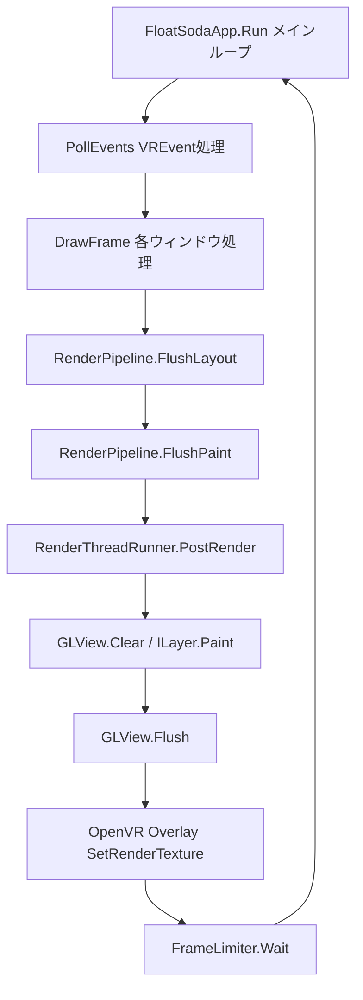

# FloatSoda: SteamVR Overlay UI Framework (v0.0.0)

**FloatSoda** は、SteamVR Overlay を **Flutter のような宣言的な書き心地** で作成できるように開発中の UI フレームワークです。VR
空間内のオーバーレイを `Window` という単位で抽象化し、直感的な UI 構築を可能にします。

---

## 🚀 特徴

* **Flutter-like な開発体験**: 宣言的な UI 構築を目指しています。
* **抽象化された Overlay**: `CreateOverlayWindow` で Floating / Dashboard ウィンドウを統一的に管理できます。
* **Skia による描画**: SkiaSharp を使用した高品質なレンダリングを行います。
* **RenderObject ツリー**: Flutter の RenderObject に相当するレイアウト・描画ツリーを実装しています。

---

## 🪟 ウィンドウの種類

### Floating Window

特定の `trackedDevice` を指定することで、デバイス（HMD、コントローラー、トラッカーなど）に追従するウィンドウを作成できます。

### Dashboard Window

`isDashboard: true` を指定すると、SteamVR のダッシュボード内に表示されるオーバーレイになります。

> [!NOTE]
> マニフェストファイルの設定ができておらず現在動作が不安定な場合があります。

---

## 🛠 UI の構築方法 (RenderObject システム)

現在は **RenderObject** ツリーを直接構築する構成になっています。

[Flutter の RenderObject 設計の参考](https://zenn.dev/fastriver/books/reimpl-flutter/viewer/layer-tree)

### 描画の仕組み



### 実装済みの RenderObject

**レイアウト系**

| クラス | 説明 |
|---|---|
| `RenderView` | ルートノード。Overlay のサイズを定義 |
| `RenderPositionedBox` | 子を中央配置 (`Alignment` 指定可) |
| `RenderFlex` | `Row` / `Column` 相当。`Axis`, `MainAxisAlignment`, `CrossAxisAlignment` などを指定可 |
| `RenderConstrainedBox` | 子に `BoxConstraints` を付与してサイズを強制 |

**描画系**

| クラス | 説明 |
|---|---|
| `RenderColoredBox` | 矩形を指定色で塗りつぶす |

**クリップ系**

| クラス | 説明 |
|---|---|
| `RenderClipRect` | 矩形でクリップ |
| `RenderClipRoundRect` | 角丸矩形でクリップ (`BorderRadius` 指定可) |
| `RenderClipPath` | 任意の `SKPath` でクリップ (`CustomClipper<SKPath>` を渡す) |
| `RenderClipOval` | 楕円でクリップ |

---

## 🏁 Getting Started

### 動作環境

- .NET 10.0 / C# 14
- OpenTK 4.9.4
- SkiaSharp 3.119.2
- SteamVR (OpenVR)

### 1. ビルド・実行方法

CLI から実行する場合は、プロジェクトのルートディレクトリで以下のコマンドを使用します。

```bash
dotnet run --project samples/FloatSoda.Samples.OverlayApp
```

### 2. 実装例

以下は、HMD 正面・左コントローラー・ダッシュボードにウィンドウを表示する構成例です。

```csharp
using System.Numerics;
using FloatSoda;
using FloatSoda.Geometrics;
using FloatSoda.Render.Layout;
using FloatSoda.Render.Painting;
using OVRSharp;
using SkiaSharp;

// 1. Builder でアプリを構成・生成
var builder = FloatSodaAppBuilder.CreateDefault();
using var app = builder.Build();

// 2. RenderObject ツリーを構築
var floatingWindow = new RenderPositionedBox
{
    Child = new RenderFlex
    {
        Direction = Axis.Vertical,
        MainAxisAlignment = MainAxisAlignment.Center,
        Children =
        [
            new RenderClipRoundRect
            {
                BorderRadius = BorderRadius.Circular(20),
                Child = new RenderConstrainedBox
                {
                    AdditionalConstraints = BoxConstraints.Tight(300, 300),
                    Child = new RenderColoredBox { Color = SKColors.CornflowerBlue }
                }
            },
            new RenderClipOval
            {
                Child = new RenderConstrainedBox
                {
                    AdditionalConstraints = BoxConstraints.Tight(300, 300),
                    Child = new RenderColoredBox { Color = SKColors.Tomato }
                }
            }
        ]
    }
};

// 3. ウィンドウを登録して実行
// Floating: HMD 正面に固定
app.CreateOverlayWindow("MainPanel", floatingWindow, new SKSize(1000, 1000),
    position: new Vector3(0, 1.2f, -1f));

// Floating: 左コントローラーに追従
app.CreateOverlayWindow("LeftHandPanel", floatingWindow, new SKSize(1000, 1000),
    trackedDevice: Overlay.TrackedDeviceRole.LeftHand);

// Dashboard: SteamVR ダッシュボード内に表示
app.CreateOverlayWindow("DashboardPanel", floatingWindow, new SKSize(1000, 1000),
    isDashboard: true);

// 4. 実行
app.Run();
```

---

## ⚠️ 開発ステータス (v0.0.0 Alpha)

本プロジェクトは現在 **概念実証（PoC）段階** です。API は予告なく変更されます。

- [ ] Widget システム (Stateless/Stateful) の導入
- [ ] Widget → RenderObject への inflate パイプラインの実装
- [ ] SteamVR のイベント処理と宣言的な入力 (ヒットテスト)
- [ ] マニフェストファイルの自動生成 (検討中)
- [ ] アニメーションシステムの統合
- [ ] Generic Host の統合

> [!TIP]
> より詳細なサンプルコードは `samples/FloatSoda.Samples.OverlayApp` を参照してください。
