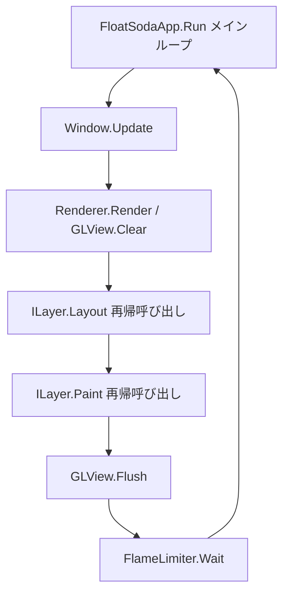

# FloatSoda: SteamVR Overlay UI Framework (v0.0.0)

**FloatSoda** は、SteamVR Overlay を **Flutter のような宣言的な書き心地** で作成できるように開発中の UI フレームワークです。VR
空間内のオーバーレイを `Window` という単位で抽象化し、直感的な UI 構築を可能にします。

---

## 🚀 特徴

* **Flutter-like な開発体験**: 宣言的な UI 構築を目指しています。
* **抽象化された Window**: `FloatingWindow` や `DashboardWindow` など、用途に合わせたウィンドウ管理が可能です。
* **Skia による描画**: `ILayer` インタフェースを介して、Skia を使用した高品質なレンダリングを行います。

---

## 🪟 ウィンドウの種類

### FloatingWindow

特定の `TrackingTarget` を指定することで、デバイス（HMD、コントローラー、トラッカーなど）に追従するウィンドウを作成できます。

### DashboardWindow

SteamVR のダッシュボード内に表示されるオーバーレイです。
> [!NOTE]
> 作成には適切な設定と初期化が必要です。（詳細な要件は今後のアップデートで追加予定）

---

## 🛠 UI の宣言方法 (Layer システム)

現在は内部表現である **Layer** を直接構築する構成になっています。
※このセクションは将来的に **破壊的な変更** が予定されています。

[Layerの実装の参考](https://zenn.dev/fastriver/books/reimpl-flutter/viewer/layer-tree)
### 描画の仕組み
ILayer が子要素の Paint メソッドを再帰的に呼び出すことで、描画ツリーを処理します。


### 実装済みのレイヤー

* **ContainerLayer**: 他のレイヤーを子要素として持ち、構造を管理します。
* **PaintLayer**: 色やサイズを指定し、実際の描画内容を定義します。

---

## 🏁 Getting Started

### 1. ビルド・実行方法

CLI から実行する場合は、プロジェクトのルートディレクトリで以下のコマンドを使用します。

```bash
dotnet run
```

### 2. 実装例

以下は、HMD の正面と左コントローラーにウィンドウを表示する最小限の構成例です。

```csharp
using System.Numerics;
using FloatSoda;
using FloatSoda.Engine;
using FloatSoda.Engine.Painting;
using SkiaSharp;

// 1. Appのインスタンスを作成
using var app = new FloatSodaApp();

// 2. Layerを作成 (※将来的にWidgetを渡すよう書き方が変更される予定です)
var centerWindowLayer = new ContainerLayer
{
    Children =
    {
        new PaintLayer { Color = SKColors.Tomato, Size = new Size(1000, 1000) },
        new PaintLayer { Color = SKColors.AliceBlue, Size = new Size(1000, 700) },
        new PaintLayer { Color = SKColors.CornflowerBlue, Size = new Size(1000, 300) }
    }
};

var leftHandWindowLayer = new ContainerLayer
{
    Children =
    {
        new PaintLayer { Color = SKColors.Tomato, Size = new Size(1000, 1000) },
    }
};

// 3. ウィンドウを登録
// 正面に固定
app.CreateFloatingWindow("MainPanel", centerWindowLayer, position: new Vector3(0, 1.2f, -1f));

// 左コントローラーに追従
app.CreateFloatingWindow("SubPanel", leftHandWindowLayer, trackingTarget: TrackingTarget.LeftController);

// 4. 実行
app.Run();
```

---

⚠️ 開発ステータス (v0.0.0 Alpha)
本プロジェクトは現在 概念実証（PoC）段階 です。
[Flutter の Layer Tree設計](https://zenn.dev/fastriver/books/reimpl-flutter/viewer/layer-tree)に基づき、基盤部分を構築中です。API は予告なく変更されます。

[ ] Widget システム (Stateless/Stateful) の導入

[ ] ヒットテスト（入力イベント）の実装

[ ] アニメーションシステムの統合

> [!TIP]
> より詳細なサンプルコードについては、リポジトリ内のサンプルプロジェクトを参照してください。