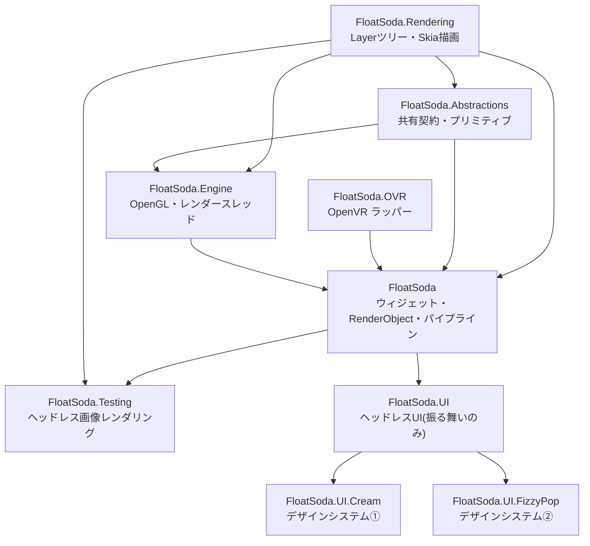
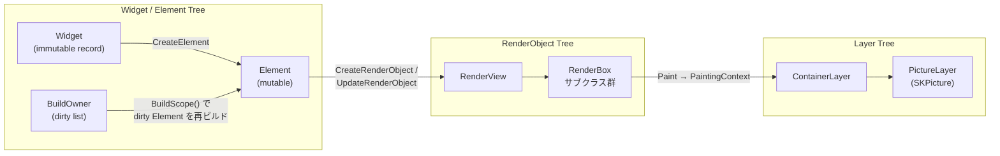
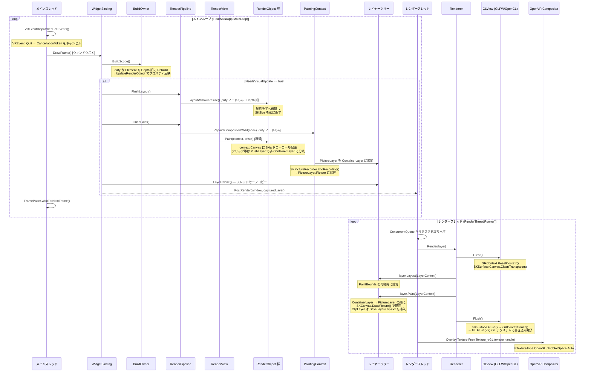

← [Home](Home.md)

# Architecture

FloatSoda は Flutter のアーキテクチャを参考に設計された VR オーバーレイ UI フレームワークです。SkiaSharp で描画コマンドを記録し、OpenGL テクスチャに焼き付けて OpenVR Compositor に提出することで SteamVR オーバーレイを表示します。

## アセンブリ構成



| アセンブリ | 役割 |
|---|---|
| `FloatSoda.Abstractions` | Engine境界契約、`Offset`などの共有値型、入力イベント、フレームペーシング |
| `FloatSoda.Rendering` | `ILayer`と具象Layer群、共通Layer描画、Bitmap描画 |
| `FloatSoda.Engine` | `IEngineWindow`などの具体実装、`GLView`、`Renderer`、`RenderThreadRunner`、`FramePacer` |
| `FloatSoda.OVR` | OpenVR 初期化（`Application`）、オーバーレイ型（`DashboardOverlay` / `WorldSpaceOverlay` / `DeviceTrackedOverlay`）、イベントディスパッチャ、例外体系 |
| `FloatSoda` | ウィジェット/エレメントツリー、RenderObject ツリー、`RenderPipeline`、`FloatSodaApp` / `FloatSodaAppBuilder` |
| `FloatSoda.Testing` | Widget・RenderObjectツリーをBitmapへ描画するヘッドレステスト支援 |
| `FloatSoda.UI` | ヘッドレスUI層。振る舞い・状態機械のみ(`ButtonBase`, `InteractionState`)。見た目は builder に委譲(→ [UILayering](UILayering.md)) |
| `FloatSoda.UI.Cream` | デザインシステム①: レトロでクリーミーな色使いのフラットデザイン(`Button`, `ButtonStyle`, `CreamTheme`) |
| `FloatSoda.UI.FizzyPop` | デザインシステム②: 透明感・グラスモーフィズム(`Button`, `ButtonStyle`, `FizzyPopTheme`) |

---

## ツリー構造

FloatSoda は Flutter の三ツリーモデルをベースに、現在 **RenderObject ツリー** と **レイヤーツリー** が完全実装済みです。ウィジェット/エレメントツリーは `StatelessWidget` / `StatefulWidget` / `InheritedWidget` と `BuildOwner` による差分ビルド(`Key` 対応の子リスト差分を含む)が実装済みです。一部の便利ウィジェットはスタブのままです(詳細は [WidgetSystem](WidgetSystem.md) と [BuildPipeline](BuildPipeline.md))。



各ツリーの役割:

- **Widget** — 宣言的な UI の設計図。`abstract record` で不変。
- **Element** — Widget と RenderObject を橋渡しするミュータブルなノード。`MarkNeedsBuild()` で dirty になり、`BuildOwner` が次フレームの `BuildScope()` でまとめて再ビルドする。`StatelessElement` / `StatefulElement` / `InheritedElement` はいずれも実装済み。
- **BuildOwner** — dirty な Element のリストを保持し、`Depth` 順(親が先)に再ビルドを実行するスケジューラ。`WidgetBinding` がウィンドウごとに 1 つ保持する。
- **RenderObject** — レイアウト計算(`PerformLayout`)と描画コマンド記録(`Paint`)を担う。`MarkNeedsLayout` / `MarkNeedsPaint` の dirty フラグにより、変更があった部分だけを再レイアウト・再ペイントする。
- **Layer** — `Paint` フェーズが生成する合成操作のツリー。クローンしてレンダースレッドに渡す。

---

## レンダリングライフサイクル



---

## スレッドモデル

| スレッド | 所有物 | 通信方法 |
|---|---|---|
| **メインスレッド** | RenderPipeline, Widget/RenderObject ツリー, VREventDispatcher | `RenderThreadRunner.PostTask(Action)` でタスクをキューに積む |
| **レンダースレッド** | OpenGL コンテキスト, `GLView`, `Renderer`, `OverlayWindow` | `ConcurrentQueue<Action>` を処理 |

OpenGL のコンテキストはレンダースレッドが独占します。ウィンドウ作成も `PostTask` 経由でレンダースレッド上で実行されます。

```
メインスレッド
  └─ RenderThreadRunner.PostTask(layer 更新ラムダ)
         │ ConcurrentQueue
         ▼
    レンダースレッド
         └─ OverlayWindow.Update()
              └─ Renderer.Render(layer)
                   └─ GLView.Clear() → layer.Paint() → GLView.Flush()
              └─ SetOverlayTexture(GL texture handle)
```

---

## 関連ページ

- [BuildPipeline](BuildPipeline.md) — BuildOwner による差分ビルドの詳細
- [RenderObjects](RenderObjects.md) — 差分レイアウト・差分ペイントの仕組み
- [OVRIntegration](OVRIntegration.md) — OpenVR オーバーレイとイベント処理
