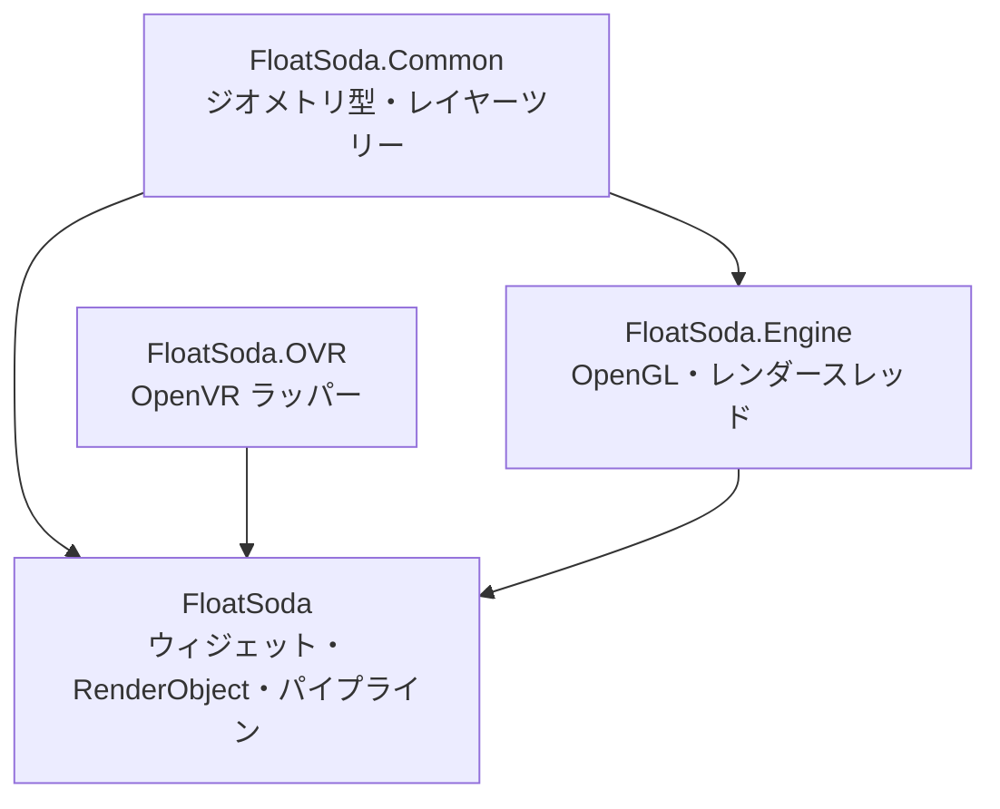
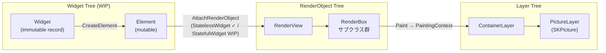
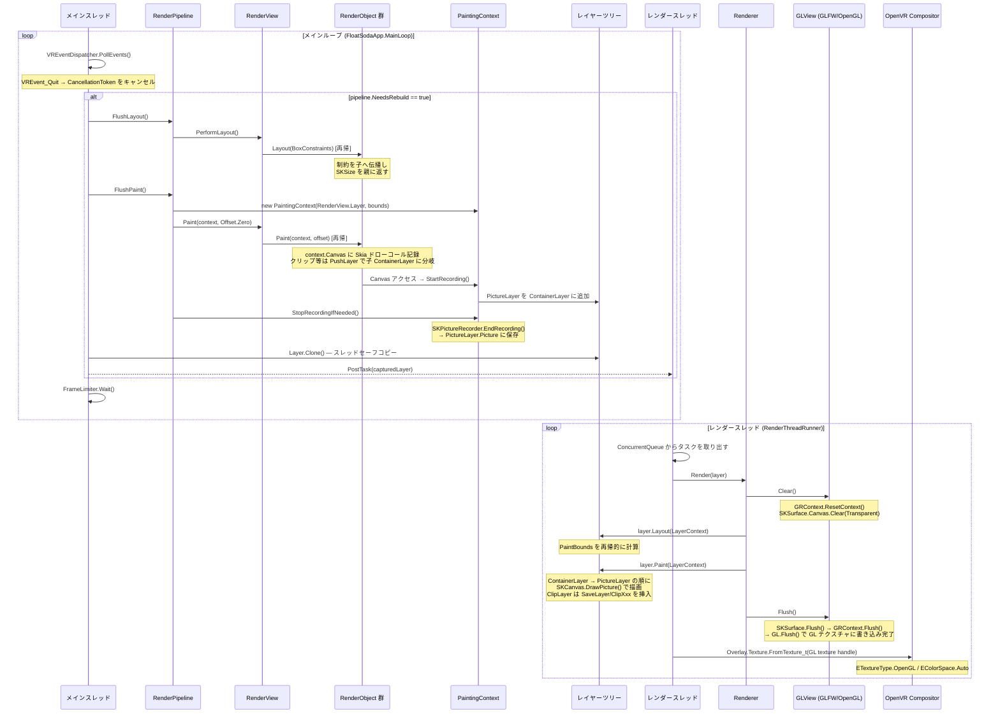

# Architecture

FloatSoda は Flutter のアーキテクチャを参考に設計された VR オーバーレイ UI フレームワークです。SkiaSharp で描画コマンドを記録し、OpenGL テクスチャに焼き付けて OpenVR Compositor に提出することで SteamVR オーバーレイを表示します。

## アセンブリ構成



| アセンブリ | 役割 |
|---|---|
| `FloatSoda.Common` | `Offset`, `Alignment`, `BoxConstraints` などのジオメトリ型。`ILayer` / `ContainerLayer` / `PictureLayer` などのレイヤーツリーインターフェース |
| `FloatSoda.Engine` | `GLView`（OpenGL サーフェス）、`Renderer`（レイヤーツリー → OpenGL FBO）、`RenderThreadRunner`（レンダースレッド管理）、`FrameLimiter` |
| `FloatSoda.OVR` | OpenVR 初期化（`Application`）、オーバーレイ型（`DashboardOverlay` / `WorldSpaceOverlay` / `DeviceTrackedOverlay`）、イベントディスパッチャ、例外体系 |
| `FloatSoda` | ウィジェット/エレメントツリー、RenderObject ツリー、`RenderPipeline`、`FloatSodaApp` / `FloatSodaAppBuilder` |

---

## ツリー構造

FloatSoda は Flutter の三ツリーモデルをベースに、現在 **RenderObject ツリー** と **レイヤーツリー** が完全実装済みです。ウィジェット/エレメントツリーは `StatelessWidget` / `StatelessElement` が実装済みで、`StatefulWidget` / `StatefulElement` は WIP です。



各ツリーの役割:

- **Widget** — 宣言的な UI の設計図。`abstract record` で不変。
- **Element** — Widget と RenderObject を橋渡しするミュータブルなノード。`StatelessElement` は実装済み。`StatefulElement` は WIP。
- **RenderObject** — レイアウト計算（`Layout`）と描画コマンド記録（`Paint`）を担う。
- **Layer** — `Paint` フェーズが生成する合成操作のツリー。クローンしてレンダースレッドに渡す。

---

## レンダリングライフサイクル



---

## スレッドモデル

| スレッド | 所有物 | 通信方法 |
|---|---|---|
| **メインスレッド** | RenderPipeline, Widget/RenderObject ツリー, VREventDispatcher | `RenderThreadRunner.PostTask(Action)` でタスクをキューに積む |
| **レンダースレッド** | OpenGL コンテキスト, `GLView`, `Renderer`, `OverlayWindow` | `ConcurrentQueue<Action>` を処理 |

OpenGL のコンテキストはレンダースレッドが独占します。ウィンドウ作成も `PostTask` 経由でレンダースレッド上で実行されます。

```
メインスレッド
  └─ RenderThreadRunner.PostTask(layer 更新ラムダ)
         │ ConcurrentQueue
         ▼
    レンダースレッド
         └─ OverlayWindow.Update()
              └─ Renderer.Render(layer)
                   └─ GLView.Clear() → layer.Paint() → GLView.Flush()
              └─ SetOverlayTexture(GL texture handle)
```
