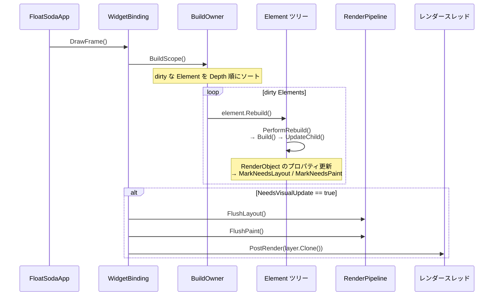

← [Home](Home.md)

# ビルドパイプライン(Widget 差分更新)

このページは Widget ツリーの差分ビルドの仕組み — `BuildOwner` / dirty list / `BuildScope` / `Element.UpdateChild` — を解説します。RenderObject 側の差分レイアウト・差分ペイントは [RenderObjects](RenderObjects.md) を参照してください。

> **実装状況:** `BuildOwner` と `StatelessElement` / `StatefulElement` / `InheritedElement` / `SingleChildRenderObjectElement` / `MultiChildRenderObjectElement`(`Key` 対応の子リスト差分)/ `RenderObjectToWidgetElement` の再ビルドが動作します。`Key`(`ValueKey<T>` / `UniqueKey`)は `Widget.CanUpdate` に組み込み済みです。

## 全体の流れ

毎フレーム `FloatSodaApp.MainLoop()` から各ウィンドウの `WidgetBinding.DrawFrame()` が呼ばれ、次の 3 段階が実行されます。



1. **ビルドフェーズ** — `BuildOwner.BuildScope()` が dirty な Element を再ビルドし、Widget ツリーの変更を RenderObject ツリーに反映します。
2. **レイアウト/ペイントフェーズ** — RenderObject 側の dirty フラグに基づき `RenderPipeline` が差分レイアウト・差分ペイントを実行します。
3. **合成フェーズ** — レイヤーツリーをクローンしてレンダースレッドへ送ります([Architecture](Architecture.md) 参照)。

---

## BuildOwner と dirty list

`BuildOwner`(`src/FloatSoda/Elements/BuildOwner.cs`)は Element の再ビルドをスケジュールする中枢です。`WidgetBinding` が 1 つ保持し、ルート Element の `Mount` 時にツリー全体へ伝播します。

### MarkNeedsBuild → ScheduledBuildFor

Element を再ビルドしたいときは `Element.MarkNeedsBuild()` を呼びます。

```csharp
public void MarkNeedsBuild()
{
    if (Dirty) return;

    Dirty = true;
    Owner?.ScheduledBuildFor(this);
}
```

`BuildOwner.ScheduledBuildFor()` は Element を dirty list に追加し、初回であれば `onBuildScheduled` コールバック(`WidgetBinding.EnsureVisualUpdate`)を発火して「このフレームは描画が必要」というフラグを立てます。

### BuildScope の再ビルドループ

`BuildScope()` は dirty list を **`Depth` 昇順(親が先)** にソートしてから順に `Rebuild()` します。親を先にビルドするのは、親の再ビルドで子も更新される場合に子の個別ビルドを無駄にしないためです(Flutter と同じ戦略)。

ビルド中に新たな Element が dirty になった場合(ビルド中の `MarkNeedsBuild`)はリストを再ソートしてループを継続します。ループ終了後に `InDirtyList` フラグをクリアして dirty list を空にします。

`Element` は `IComparable<Element>` を実装しており、`Depth` → `Dirty` の順で比較されます。

---

## Element の再ビルドと UpdateChild

再ビルドの実体は各 Element の `PerformRebuild()` です。

### ComponentElement(StatelessElement など)

```csharp
public override void PerformRebuild()
{
    var built = Build();          // StatelessWidget.Build(this) を呼ぶ
    Dirty = false;
    Child = UpdateChild(Child, built);
}
```

`UpdateChild(child, newWidget)` は Widget の差分を Element ツリーに適用する中心的メソッドです。

| 条件 | 動作 |
|---|---|
| `newWidget == null` | 子を `DeactivateChild`(RenderObject をツリーから切断)して破棄 |
| 子がいない | `InflateWidget` で新しい Element を作成して `Mount` |
| `child.Widget == newWidget`(完全一致) | 何もしない(Element を再利用) |
| `Widget.CanUpdate(old, new)` | `child.Update(newWidget)` で既存 Element を更新 |
| それ以外 | 子を破棄して `InflateWidget` で作り直し |

> **`CanUpdate` の判定:** `Widget.CanUpdate(old, new)` は Flutter と同じく「同じ実行時型かつ `Key` が等しい」なら `true` を返し、既存 Element を再利用します。その手前にある `child.Widget == newWidget`(record の等値比較)は完全一致を素通しする高速パスで、ここで一致すれば `Update` すら呼びません。プロパティだけが変わった同型・同 Key の Widget は Element を再利用してプロパティ差分だけが適用されます。`Key`(`ValueKey<T>` / `UniqueKey`)は `Widget.Key` として差分判定に組み込み済みです。

### RenderObjectElement

`RenderObjectElement<T>` は `Mount` 時に `CreateRenderObject()` で RenderObject を生成し、`AttachRenderObject()` で最も近い祖先 RenderObjectElement の RenderObject に挿入します(Widget ツリー上では `StatelessWidget` などレンダリングを伴わない Element を挟めるため、探索が必要です)。

更新時は `PerformRebuild()` が `Widget.UpdateRenderObject(renderObject)` を呼び、**既存の RenderObject のプロパティだけを書き換えます**。プロパティのセッターが `MarkNeedsLayout()` / `MarkNeedsPaint()` を呼ぶことで、RenderObject 側の差分更新([RenderObjects](RenderObjects.md))につながります。

```
Widget が変わる
  → Element.Update → UpdateRenderObject
    → RenderObject のプロパティ変更
      → MarkNeedsLayout / MarkNeedsPaint
        → RenderPipeline の dirty list へ
          → FlushLayout / FlushPaint(変わった部分だけ)
```

---

## ルートの接続: RenderObjectToWidgetAdapter

Widget ツリーのルートは `RenderObjectToWidgetAdapter`(Widget)と `RenderObjectToWidgetElement<RenderView>`(Element)のペアが `RenderView` に橋渡しします。

```csharp
RenderViewElement = new RenderObjectToWidgetAdapter
    {
        Child = rootWidget,
        Container = Pipeline.RenderView
    }
    .AttachToRenderTree(BuildOwner, RenderViewElement as RenderObjectToWidgetElement<RenderView>);
```

`AttachToRenderTree(owner, element)` の動作:

- **初回(`element == null`)** — Element を生成し、`owner.BuildScope(() => result.Mount(null))` でビルドスコープ内にツリー全体を `Mount` します。
- **2 回目以降** — 既存 Element の `NewWidget` に新しいルート Widget をセットして `MarkNeedsBuild()` するだけです。実際の適用は次の `BuildScope()` 内の `PerformRebuild()` で行われます(ホットリロードやルート差し替えに対応)。

---

## WidgetBinding.DrawFrame

`WidgetBinding`(`src/FloatSoda/Core/WidgetBinding.cs`)はウィンドウ(オーバーレイ)ごとの調整役です。

```csharp
public void DrawFrame()
{
    if (RenderViewElement != null)
    {
        BuildOwner.BuildScope();          // 1. dirty Element の再ビルド
    }

    if (!NeedsVisualUpdate || Window == null) return;   // 変更がなければ何もしない
    NeedsVisualUpdate = false;

    Pipeline?.FlushLayout();              // 2. 差分レイアウト
    PostResizeIfSizeChanged();            // レイアウト結果にオーバーレイサイズを追従
    Pipeline?.FlushPaint();               // 3. 差分ペイント

    if (Pipeline?.RenderView.Layer?.Clone() is not ContainerLayer layer) return;

    RenderThreadRunner?.PostRender(Window, layer);   // 4. レンダースレッドへ
}
```

`NeedsVisualUpdate` は次のいずれかで立ちます。

- `BuildOwner` がビルドをスケジュールしたとき(`onBuildScheduled`)
- RenderObject が `MarkNeedsLayout` / `MarkNeedsPaint` したとき(`RenderPipeline.OnNeedVisualUpdate`)

つまり **Widget にも RenderObject にも変更がないフレームでは、レイアウト・ペイント・合成のすべてがスキップされます**。

---

## 未実装の領域

| 対象 | 現状 |
|---|---|
| 一部の便利ウィジェット | `Padding` / `Container` / `ListView` / `GridView` / `SingleChildScrollView` / `Opacity` と旧 `Components.Icon` / `Components.Image` は未実装のため `internal`。入力系の `GestureDetector` / `Listener` は公開スタブ |
| デザインシステムの `Button` | `FloatSoda.UI.Cream` / `FloatSoda.UI.FizzyPop` にスケルトン実装済み。ジェスチャ・ヒットテストとの配線待ち |
| ジェスチャ・ヒットテスト | 宣言的な入力(タップ・ドラッグ)は未実装 |
| `FloatSoda.Hooks` | `HookWidget` / `HookElement`(R3 の `ReactiveProperty` による `UseState`)が部分実装。フレームワークのビルドループとは未統合で、`HookExtension` の各ヘルパーは `NotImplementedException` |

---

## 関連ページ

- [Architecture](Architecture.md) — フレーム全体の流れとスレッドモデル
- [WidgetSystem](WidgetSystem.md) — Widget / Element の使い方と組み込みウィジェット
- [RenderObjects](RenderObjects.md) — RenderObject 側の差分レイアウト・差分ペイント
