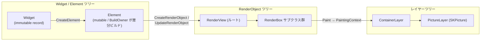

# FloatSoda ドキュメント

**FloatSoda** は、SteamVR Overlay を Flutter のような宣言的な書き心地で作成できる .NET 10 / C# 14 向け UI フレームワークです。SkiaSharp → OpenGL (GLFW/OpenTK) → OpenVR という経路でレンダリングします。

このページはドキュメント全体の入り口です。各ページは相互リンクでつながっています。

---

## ページ一覧

| ページ | 内容 | 対象読者 |
|---|---|---|
| [GettingStarted](GettingStarted.md) | 環境構築・サンプル実行・最初のアプリ作成 | 利用者 |
| [Architecture](Architecture.md) | アセンブリ構成・ツリー構造・スレッドモデル | 利用者 / コントリビュータ |
| [WidgetSystem](WidgetSystem.md) | Widget / Element システムと組み込みウィジェット一覧 | 利用者 |
| [BuildPipeline](BuildPipeline.md) | BuildOwner による差分ビルドとフレームパイプラインの詳細 | コントリビュータ |
| [RenderObjects](RenderObjects.md) | RenderObject ツリーのリファレンス(レイアウト・描画) | コントリビュータ |
| [OVRIntegration](OVRIntegration.md) | OpenVR ラッパー・オーバーレイ種別・イベント処理 | 利用者 / コントリビュータ |
| [APIDesign](APIDesign.md) | API 設計規約(コンポーネント設計・命名・イミュータビリティ) | コントリビュータ |

## どこから読むか

- **FloatSoda でオーバーレイを作りたい** → [GettingStarted](GettingStarted.md) → [WidgetSystem](WidgetSystem.md) → [OVRIntegration](OVRIntegration.md)
- **フレームワークの内部を理解したい / コントリビュートしたい** → [Architecture](Architecture.md) → [BuildPipeline](BuildPipeline.md) → [RenderObjects](RenderObjects.md) → [APIDesign](APIDesign.md)

---

## 全体像: 三つのツリー

FloatSoda は Flutter の三ツリーモデルを踏襲しています。宣言的な Widget ツリーが Element ツリーを介して RenderObject ツリーを構築・更新し、RenderObject の描画結果がレイヤーツリーとしてレンダースレッドに渡ります。

- **Widget** — UI の設計図。`abstract record` で不変。フレームごとに再生成しても等値比較で差分検知できます。→ [WidgetSystem](WidgetSystem.md)
- **Element** — Widget と RenderObject を橋渡しする永続ノード。`BuildOwner` が dirty な Element だけを再ビルドします。→ [BuildPipeline](BuildPipeline.md)
- **RenderObject** — レイアウト(`PerformLayout`)と描画(`Paint`)を担い、dirty フラグで差分レイアウト・差分ペイントを行います。→ [RenderObjects](RenderObjects.md)
- **Layer** — 描画結果の合成ツリー。`Clone()` してレンダースレッドへ渡します。→ [Architecture](Architecture.md)

---

## 実装状況サマリ

現在 Alpha(概念実証段階)です。主要コンポーネントの実装状況は以下のとおりです。詳細は各ページの実装状況欄を参照してください。

| 領域 | 状況 |
|---|---|
| RenderObject ツリー(レイアウト・描画・クリップ・差分更新) | ✓ 実装済み |
| レイヤーツリーとレンダースレッド分離 | ✓ 実装済み |
| 複数オーバーレイ(ダッシュボード / ワールド座標 / デバイス追従) | ✓ 実装済み |
| `StatelessWidget` / `StatelessElement` | ✓ 実装済み |
| `BuildOwner` による差分ビルド(dirty list / BuildScope) | ✓ 実装済み |
| `SingleChildRenderObjectWidget` 系の更新(`UpdateRenderObject`) | ✓ 実装済み(一部ウィジェットは未対応) |
| `MultiChildRenderObjectElement` の再ビルド(子リストの差分) | ✗ 未実装 |
| `StatefulWidget` / `StatefulElement` | ✗ スケルトンのみ |
| `InheritedWidget` / `InheritedElement` | ✗ スケルトンのみ |
| `Key` によるElement再利用 | ✗ 型定義のみ(Widget に未接続) |
| Hooks(`FloatSoda.Hooks` / R3 ベースの `UseState`) | △ WIP(フレームワーク未統合) |
| ジェスチャ・ヒットテスト | ✗ 未実装 |

---

## リポジトリ構成

| プロジェクト | 役割 |
|---|---|
| `src/FloatSoda.Common` | ジオメトリ型(`Offset` など)とレイヤーツリー |
| `src/FloatSoda.Engine` | GLFW/OpenGL・レンダースレッド・フレームリミッタ |
| `src/FloatSoda.OVR` | OpenVR ラッパー・オーバーレイ型・イベントディスパッチャ |
| `src/FloatSoda` | フレームワーク本体(Widget / Element / RenderObject / パイプライン) |
| `src/FloatSoda.Hooks` | R3 ベースのフックAPI(WIP) |
| `samples/` | サンプルアプリ(SteamVR 必須) |
| `tests/` | xunit テスト |
