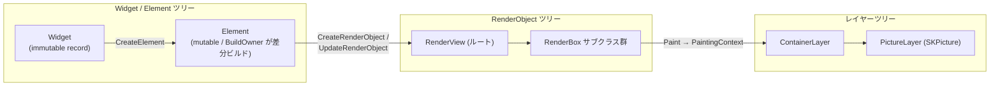

# FloatSoda ドキュメント

**FloatSoda** は、SteamVR Overlay を Flutter のような宣言的な書き心地で作成できる .NET 10 / C# 14 向け UI フレームワークです。SkiaSharp → OpenGL (GLFW/OpenTK) → OpenVR という経路でレンダリングします。

このページはドキュメント全体の入り口です。各ページは相互リンクでつながっています。

---

## ページ一覧

| ページ | 内容 | 対象読者 |
|---|---|---|
| [TargetUsers](TargetUsers.md) | FloatSoda が想定する3タイプの作り手と読み進め方 | 利用者 |
| [GettingStarted](GettingStarted.md) | 環境構築・サンプル実行・最初のアプリ作成 | 利用者 |
| [Architecture](Architecture.md) | アセンブリ構成・ツリー構造・スレッドモデル | 利用者 / コントリビュータ |
| [WidgetSystem](WidgetSystem.md) | Widget / Element システムと組み込みウィジェット一覧 | 利用者 |
| [UILayering](UILayering.md) | UI層の3層パッケージ構成(ヘッドレス / デザインシステム) | 利用者 / コントリビュータ |
| [Animation](Animation.md) | AnimationController・Ticker・Curves によるアニメーション | 利用者 / コントリビュータ |
| [BuildPipeline](BuildPipeline.md) | BuildOwner による差分ビルドとフレームパイプラインの詳細 | コントリビュータ |
| [RenderObjects](RenderObjects.md) | RenderObject ツリーのリファレンス(レイアウト・描画) | コントリビュータ |
| [OVRIntegration](OVRIntegration.md) | OpenVR ラッパー・オーバーレイ種別・イベント処理 | 利用者 / コントリビュータ |
| [Input](Input.md) | アクション入力(コントローラーのボタン・トリガー・スティック) | 利用者 |
| [APIDesign](APIDesign.md) | API 設計規約(コンポーネント設計・命名・イミュータビリティ) | コントリビュータ |
| [DocumentationComments](DocumentationComments.md) | ドキュメントコメント規約(適用範囲・契約・副作用の明記) | コントリビュータ |
| [Localization](Localization.md) | ローカライゼーション方針(日本語デフォルト・resx・サテライトXML) | コントリビュータ |

## どこから読むか

自分がどのタイプの作り手かを [TargetUsers](TargetUsers.md) で確認すると、最短の読み進め方がわかります。

- **FloatSoda でオーバーレイを作りたい** → [GettingStarted](GettingStarted.md) → [WidgetSystem](WidgetSystem.md) → [OVRIntegration](OVRIntegration.md)
- **フレームワークの内部を理解したい / コントリビュートしたい** → [Architecture](Architecture.md) → [BuildPipeline](BuildPipeline.md) → [RenderObjects](RenderObjects.md) → [APIDesign](APIDesign.md) → [DocumentationComments](DocumentationComments.md)

---

## 全体像: 三つのツリー

FloatSoda は Flutter の三ツリーモデルを踏襲しています。宣言的な Widget ツリーが Element ツリーを介して RenderObject ツリーを構築・更新し、RenderObject の描画結果がレイヤーツリーとしてレンダースレッドに渡ります。

- **Widget** — UI の設計図。`abstract record` で不変。フレームごとに再生成しても等値比較で差分検知できます。→ [WidgetSystem](WidgetSystem.md)
- **Element** — Widget と RenderObject を橋渡しする永続ノード。`BuildOwner` が dirty な Element だけを再ビルドします。→ [BuildPipeline](BuildPipeline.md)
- **RenderObject** — レイアウト(`PerformLayout`)と描画(`Paint`)を担い、dirty フラグで差分レイアウト・差分ペイントを行います。→ [RenderObjects](RenderObjects.md)
- **Layer** — 描画結果の合成ツリー。`Clone()` してレンダースレッドへ渡します。→ [Architecture](Architecture.md)

---

## ロードマップ(Phase)

開発は Phase 単位で進めています。Phase は「フレームワークとして何ができる段階か」を表す機能上の到達点で、NuGet のバージョン番号とは対応しません。バージョンはリリースの通し番号として独立に上がり、同じ Phase 中に複数のバージョンが公開されることがあります(バージョン番号から Phase を推定することはできません。`1.0.0` のみ Phase 7 に対応)。各 Phase の詳細スコープは [GitHub マイルストーン](https://github.com/sumx21t-3310/FloatSoda/milestones) を参照してください。

| Phase | 内容 | 状況 |
|---|---|---|
| Phase 1 | 入力基盤(HitTest / Pointer / Gesture) | 🚧 進行中 |
| Phase 2 | basic.dart 相当の表示系ウィジェット網羅(画像・アイコン含む) | 未着手 |
| Phase 3 | スクロールとアニメーションの充実(Tween / 暗黙的アニメーション / 物理シミュレーション) | 未着手 |
| Phase 4 | Hooks・テキスト入力・API安定化 | 未着手 |
| Phase 5 | Cream / FizzyPop デザインシステム完成 | 未着手 |
| Phase 6 | DX 向上(Storybook・manifest 自動生成・ライフサイクル) | 未着手 |
| Phase 7 | 安定版リリース(1.0) | 未着手 |

> ⚠️ Phase 1 が完了するまで、ヒットテスト・ボタン押下などの**ユーザー操作は動作しません**(表示専用)。

---

## 実装状況サマリ

現在 Alpha 段階(Phase 1 進行中)です。主要コンポーネントの実装状況は以下のとおりです。詳細は各ページの実装状況欄を参照してください。

| 領域 | 状況 |
|---|---|
| RenderObject ツリー(レイアウト・描画・クリップ・差分更新) | ✓ 実装済み |
| レイヤーツリーとレンダースレッド分離 | ✓ 実装済み |
| 複数オーバーレイ(ダッシュボード / ワールド座標 / デバイス追従) | ✓ 実装済み |
| `StatelessWidget` / `StatelessElement` | ✓ 実装済み |
| `BuildOwner` による差分ビルド(dirty list / BuildScope) | ✓ 実装済み |
| `SingleChildRenderObjectWidget` 系の更新(`UpdateRenderObject`) | ✓ 実装済み(一部ウィジェットは未対応) |
| `MultiChildRenderObjectElement` の再ビルド(子リストの差分) | ✓ 実装済み(`Key` 対応の両端差分) |
| `StatefulWidget` / `StatefulElement`(`SetState` 再ビルド) | ✓ 実装済み |
| `InheritedWidget` / `InheritedElement`(依存追跡・通知) | ✓ 実装済み |
| `Key` による Element 再利用(`Widget.CanUpdate` = 型 + Key) | ✓ 実装済み |
| アニメーション(`AnimationController` / `Ticker` / `Curve`・`Curves` / `FadeTransition`) | ✓ 実装済み |
| 一部の便利ウィジェット(`Padding` / `Container` / `ListView` など) | ✗ 未実装のため `internal` |
| UI3層構成(`FloatSoda.UI` ヘッドレス / `Cream` / `FizzyPop`) | △ スケルトン(`ButtonBase` / `Button`、ジェスチャ配線待ち) |
| Hooks(`FloatSoda.Hooks` / R3 ベースの `UseState`) | △ WIP(フレームワーク未統合) |
| ジェスチャ・ヒットテスト | ✗ 未実装 |

---

## リポジトリ構成

| プロジェクト | 役割 |
|---|---|
| `src/FloatSoda.Abstractions` | Engine境界契約、共有値型、入力イベント、フレームペーシング |
| `src/FloatSoda.Rendering` | Layerツリー、共通Layer描画、Bitmap描画 |
| `src/FloatSoda.Engine` | GLFW/OpenGL・レンダースレッド・フレームリミッタ |
| `src/FloatSoda.OVR` | OpenVR ラッパー・オーバーレイ型・イベントディスパッチャ |
| `src/FloatSoda` | フレームワーク本体(Widget / Element / RenderObject / パイプライン) |
| `src/FloatSoda.Testing` | Widget・RenderObjectのヘッドレスBitmap描画 |
| `src/FloatSoda.UI` | ヘッドレスUI層(振る舞いのみ、見た目なし)→ [UILayering](UILayering.md) |
| `src/FloatSoda.UI.Cream` | デザインシステム①(レトロ・クリーミー・フラット) |
| `src/FloatSoda.UI.FizzyPop` | デザインシステム②(透明感・グラスモーフィズム) |
| `src/FloatSoda.Hooks` | R3 ベースのフックAPI(WIP) |
| `samples/` | サンプルアプリ(SteamVR 必須) |
| `tests/` | xunit テスト |
