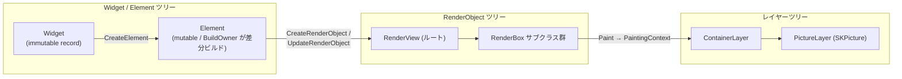

# FloatSoda ドキュメント

**FloatSoda** は、SteamVR Overlay を Flutter のような宣言的な書き心地で作成できる .NET 10 / C# 14 向け UI フレームワークです。SkiaSharp → OpenGL (GLFW/OpenTK) → OpenVR という流れでレンダリングします。

このページはドキュメント全体の入り口です。各ページは相互にリンクしています。

## ページ一覧

| ページ | 内容 | 対象読者 |
|---|---|---|
| [TargetUsers](TargetUsers.md) | FloatSoda が想定する3タイプの作り手と読み進め方 | 利用者 |
| [GettingStarted](GettingStarted.md) | 環境構築・サンプル実行・最初のアプリ作成 | 利用者 |
| [Architecture](Architecture.md) | アセンブリ構成・ツリー構造・スレッドモデル | 利用者 / コントリビュータ |
| [WidgetSystem](WidgetSystem.md) | Widget / Element システムと組み込みウィジェット一覧 | 利用者 |
| [UILayering](UILayering.md) | UI層の3層パッケージ構成(ヘッドレス / デザインシステム)。**設計方針であり未提供** | コントリビュータ |
| [Animation](Animation.md) | AnimationController・Ticker・Curves によるアニメーション | 利用者 / コントリビュータ |
| [BuildPipeline](BuildPipeline.md) | BuildOwner による差分ビルドとフレームパイプラインの詳細 | コントリビュータ |
| [RenderObjects](RenderObjects.md) | RenderObject ツリーのリファレンス(レイアウト・描画) | コントリビュータ |
| [OVRIntegration](OVRIntegration.md) | OpenVR ラッパー・オーバーレイ種別・イベント処理 | 利用者 / コントリビュータ |
| [Input](Input.md) | アクション入力(コントローラーのボタン・トリガー・スティック) | 利用者 |
| [APIDesign](APIDesign.md) | API 設計規約(コンポーネント設計・命名・イミュータビリティ) | コントリビュータ |
| [DocumentationComments](DocumentationComments.md) | ドキュメントコメント規約(適用範囲・契約・副作用の明記) | コントリビュータ |
| [WritingDocumentation](WritingDocumentation.md) | ドキュメント執筆ガイド(どこに書くか・情報ごとの置き場所・変更時に更新する文書・種別ごとのテンプレート) | コントリビュータ |
| [Localization](Localization.md) | ローカライゼーション方針(日本語デフォルト・resx・サテライトXML) | コントリビュータ |
| [TestStrategy](TestStrategy.md) | テスト戦略(範囲 × 目的 × オラクルの3軸・現在の配置・既知の穴) | コントリビュータ |

## どこから読むか

[TargetUsers](TargetUsers.md) で自分がどのタイプの作り手かを確認すると、最短の読み進め方がわかります。

- **FloatSoda でオーバーレイを作りたい** → [GettingStarted](GettingStarted.md) → [WidgetSystem](WidgetSystem.md) → [OVRIntegration](OVRIntegration.md)
- **フレームワークの内部を理解したい / コントリビュートしたい** → [Architecture](Architecture.md) → [BuildPipeline](BuildPipeline.md) → [RenderObjects](RenderObjects.md) → [APIDesign](APIDesign.md) → [DocumentationComments](DocumentationComments.md) → [WritingDocumentation](WritingDocumentation.md)

## 全体像: 三つのツリー

FloatSoda は Flutter の三ツリーモデルを踏襲しています。宣言的な Widget ツリーは Element ツリーを介して RenderObject ツリーを構築・更新します。RenderObject の描画結果は、レイヤーツリーとしてレンダースレッドへ渡されます。

```mermaid
graph LR
    subgraph "Widget / Element ツリー"
        W["Widget<br/>(immutable record)"]
        E["Element<br/>(mutable / BuildOwner が差分ビルド)"]
        W -->|CreateElement| E
    end

    subgraph "RenderObject ツリー"
        RV["RenderView (ルート)"]
        RB["RenderBox サブクラス群"]
        RV --> RB
    end

    subgraph "レイヤーツリー"
        CL["ContainerLayer"]
        PL["PictureLayer (SKPicture)"]
        CL --> PL
    end

    E -->|"CreateRenderObject /<br/>UpdateRenderObject"| RV
    RB -->|"Paint → PaintingContext"| CL
```

- **Widget** — UI の設計図です。`abstract record` の不変オブジェクトであり、フレームごとに再生成しても等値比較で差分を検知できます。→ [WidgetSystem](WidgetSystem.md)
- **Element** — Widget と RenderObject を橋渡しする永続ノードです。`BuildOwner` が dirty な Element だけを再ビルドします。→ [BuildPipeline](BuildPipeline.md)
- **RenderObject** — レイアウト(`PerformLayout`)と描画(`Paint`)を担います。dirty フラグを用いて、差分レイアウトと差分ペイントを行います。→ [RenderObjects](RenderObjects.md)
- **Layer** — 描画結果を合成するツリーです。`Clone()` で複製し、レンダースレッドへ渡します。→ [Architecture](Architecture.md)

## ロードマップ(Phase)

開発は Phase 単位で進めています。Phase は「フレームワークとして何ができる段階か」を表す機能上の到達点であり、NuGet のバージョン番号とは連動しません。バージョンはリリースの通し番号として独立して上がります。同じ Phase 中に複数のバージョンが公開されることもあるため、バージョン番号から Phase は推定できません(ただし、`1.0.0` のみ Phase 7 に対応します)。各 Phase の詳細スコープは [GitHub マイルストーン](https://github.com/sumx21t-3310/FloatSoda/milestones) を参照してください。

| Phase | 内容 | 状況 |
|---|---|---|
| Phase 1 | 入力基盤(HitTest / Pointer / Gesture) | 🚧 進行中 |
| Phase 2 | basic.dart 相当の表示系ウィジェット網羅(画像・アイコン含む) | 🚧 進行中 |
| Phase 3 | スクロールとアニメーションの充実(Tween / 暗黙的アニメーション / 物理シミュレーション) | 未着手 |
| Phase 4 | Hooks・テキスト入力・API安定化 | 未着手 |
| Phase 5 | Cream / FizzyPop デザインシステム完成 | 未着手 |
| Phase 6 | DX 向上(Storybook・manifest 自動生成・ライフサイクル) | 未着手 |
| Phase 7 | 安定版リリース(1.0) | 未着手 |

> ⚠️ **現在、ユーザー操作が機能するのはダッシュボードオーバーレイのみです。**
> ヒットテストとジェスチャ認識は実装済みであり、`GestureDetector` でタップとパンを受け取れます。
> ただし、ポインタ座標の供給元(SteamVR のレーザーポインター)がダッシュボードオーバーレイにしか
> 接続されていないため、`WorldSpaceWindow` と `DeviceTrackedWindow` は表示専用です。
> また、**UI3層構成(`FloatSoda.UI` と `Cream` / `FizzyPop`)は未提供です。**
> 3プロジェクトとも NuGet では未配布であり、`Button` は骨組みのみで押下に反応しません(Phase 5 で提供予定)。
> ボタンは `GestureDetector` を使って組み立ててください
> (→ [WidgetSystem](WidgetSystem.md#押せるボタンを作る))。

進行中の2つの Phase に残っている主な作業は次のとおりです。

| Phase | 残件 |
|---|---|
| Phase 1 | 非ダッシュボードオーバーレイへのポインタ接続(コントローラーレイからの入力) |
| Phase 2 | `ImageProvider` の拡充、`CustomPaint`、`ViewMetrics`(`MediaQuery` 相当) |

## 実装状況サマリ

現在は Alpha 段階(Phase 1 と Phase 2 が並行して進行中)です。主要コンポーネントの実装状況は以下のとおりです。詳細は各ページの実装状況欄を参照してください。

状況欄の記号は次の意味を表します。

| 記号 | 意味 |
|---|---|
| ✓ 実装済み | 公開 API として使える |
| △ 部分実装 | 使えるが、機能の一部が未完成 |
| ✗ 未実装 | 公開 API からは使えない(型が `internal`、または未接続) |
| 予定 | 設計は決まっているが、使える形では提供していない |

| 領域 | 状況 |
|---|---|
| RenderObject ツリー(レイアウト・描画・クリップ・差分更新) | ✓ 実装済み |
| レイヤーツリーとレンダースレッド分離 | ✓ 実装済み |
| 複数オーバーレイ(ダッシュボード / ワールド座標 / デバイス追従) | ✓ 実装済み |
| `StatelessWidget` / `StatelessElement` | ✓ 実装済み |
| `BuildOwner` による差分ビルド(dirty list / BuildScope) | ✓ 実装済み |
| `SingleChildRenderObjectWidget` 系の更新(`UpdateRenderObject`) | ✓ 実装済み |
| `MultiChildRenderObjectElement` の再ビルド(子リストの差分) | ✓ 実装済み(`Key` 対応の両端差分) |
| `StatefulWidget` / `StatefulElement`(`SetState` 再ビルド) | ✓ 実装済み |
| `InheritedWidget` / `InheritedElement`(依存追跡・通知) | ✓ 実装済み |
| `ParentDataWidget<T>`(`Expanded` / `Flexible` / `Positioned` の基盤) | ✓ 実装済み |
| `Key` による Element 再利用(`Widget.CanUpdate` = 型 + Key) | ✓ 実装済み |
| アニメーション(`AnimationController` / `Ticker` / `Curve`・`Curves` / `FadeTransition`) | ✓ 実装済み |
| テキスト表示(`Text` / `RichText` / `TextSpan` / `TextStyle` / `DefaultTextStyle`) | ✓ 実装済み |
| 画像表示(描画系の `Paint.Image` + `FileImageProvider`) | ✓ 実装済み |
| アイコン表示(描画系の `Paint.Icon` + `IconData` / `FontProvider`) | ✓ 実装済み |
| レイアウト系ウィジェット(`Padding` / `Stack` / `Wrap` / `Expanded` / `AspectRatio` ほか) | ✓ 実装済み(→ [WidgetSystem](WidgetSystem.md#組み込みウィジェット一覧)) |
| 描画系ウィジェット(`DecoratedBox` / `Opacity` / `Transform` / `Clip*` / `RepaintBoundary`) | ✓ 実装済み |
| intrinsic 測定(`IntrinsicWidth` / `IntrinsicHeight`) | ✓ 実装済み |
| ヒットテスト(座標 → RenderObject の特定) | ✓ 実装済み |
| ジェスチャ認識(`GestureDetector` / `Listener` / タップ・パン) | ✓ 実装済み |
| ポインタ入力源(SteamVR レーザーポインターの接続) | △ 部分実装(ダッシュボードオーバーレイのみ) |
| `Container` | ✓ 実装済み(`Padding` の合成を含む) |
| UI3層構成(`FloatSoda.UI` ヘッドレス / `Cream` / `FizzyPop`) | 予定(Phase 5)。NuGet 未配布・骨組みのみ(→ [UILayering](UILayering.md#実装状況)) |
| Hooks(`FloatSoda.Hooks` / R3 ベースの `UseState`) | △ 部分実装(フレームワーク未統合) |
| スクロール(`ListView` / `GridView` / `SingleChildScrollView`) | ✗ 未実装(`internal`) |

## リポジトリ構成

| プロジェクト | 役割 |
|---|---|
| `src/FloatSoda.Abstractions` | Engine境界契約、共有値型、入力イベント、フレームペーシング |
| `src/FloatSoda.Rendering` | Layerツリー、共通Layer描画、Bitmap描画 |
| `src/FloatSoda.Engine` | GLFW/OpenGL・レンダースレッド・フレームリミッタ |
| `src/FloatSoda.OVR` | OpenVR ラッパー・オーバーレイ型・イベントディスパッチャ |
| `src/FloatSoda` | フレームワーク本体(Widget / Element / RenderObject / パイプライン) |
| `src/FloatSoda.Testing` | Widget・RenderObjectのヘッドレスBitmap描画 |
| `src/FloatSoda.UI` | ヘッドレスUI層(振る舞いのみ、見た目なし)。Phase 5 の予定 → [UILayering](UILayering.md) |
| `src/FloatSoda.UI.Cream` | デザインシステム①(レトロ・クリーミー・フラット)。Phase 5 の予定 |
| `src/FloatSoda.UI.FizzyPop` | デザインシステム②(透明感・グラスモーフィズム)。Phase 5 の予定 |
| `src/FloatSoda.Hooks` | R3 ベースのフックAPI(部分実装) |
| `samples/` | サンプルアプリ(SteamVR 必須) |
| `tests/` | xunit テスト |
