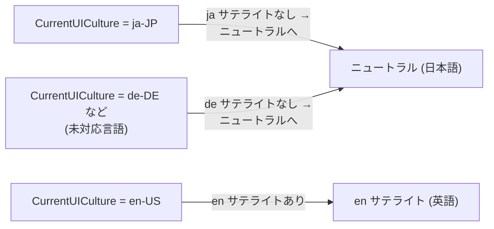

← [Home](Home.md)

# Localization

このドキュメントは、FloatSoda のローカライゼーション方針(言語の優先順位・リソースの持ち方・翻訳の追加手順)をまとめたものです。

---

## 1. 基本方針: 日本語がデフォルト

FloatSoda は**日本語をニュートラル(既定)言語**とし、英語をサテライトリソースとして提供します。

これは意図的な選択です。[TargetUsers](TargetUsers.md) が定義する3ペルソナ(バイブコーディングする VRChatter・Booth 創作者・uGUI を避けたいエンジニア)はいずれも日本語話者を第一に想定しており、`docs/` も日本語で書かれています。例外メッセージ・ドキュメントコメント・ドキュメントの言語が日本語で揃うことで、バイブコーディング時に LLM がユーザーへ提示するエラー説明の言語も一致します。

対象ごとの方針は次の通りです。

| 対象 | 方針 |
|---|---|
| 例外メッセージ | resx でローカライズ。ニュートラル = 日本語、`en` サテライト = 英語(実装済み) |
| XML ドキュメントコメント | ソースには**日本語のみ**を書く。英語版は将来サテライト XML で後付け(未実装、§4) |
| `docs/` 配下のドキュメント | 日本語のみ |
| API 識別子(型名・プロパティ名) | 英語(.NET の慣習通り。ローカライズ対象外) |

> **コントリビュータへ**: この方針を知らずに「英語がデフォルトであるべき」と直したくなるかもしれませんが、ニュートラル = 日本語は意図的な設計判断です。変更する場合は必ず issue で議論してください。

---

## 2. フォールバックの仕組み

リソース解決は `CultureInfo.CurrentUICulture`(通常は OS の表示言語)に基づく .NET 標準のフォールバックに従います。



重要な含意が1つあります: **日本語でも英語でもない環境(ドイツ語 Windows など)では日本語が表示されます**。国際展開を最優先するなら「ニュートラル = 英語、`ja` サテライト = 日本語」が定石ですが、FloatSoda は主客層と Booth 流通を優先して「迷ったら日本語」を選んでいます。

---

## 3. 例外メッセージ (実装済み)

`FloatSoda.OVR` の例外メッセージは resx でローカライズされています。

| ファイル | 役割 |
|---|---|
| `src/FloatSoda.OVR/Exceptions/Resources/ExceptionMessages.resx` | ニュートラルリソース(**日本語**)。メインアセンブリに埋め込まれる |
| `src/FloatSoda.OVR/Exceptions/Resources/ExceptionMessages.en.resx` | 英語サテライト。`en/FloatSoda.OVR.resources.dll` として出力される |
| `src/FloatSoda.OVR/Exceptions/Resources/ExceptionMessages.cs` | 強い型付けアクセサ。`ResourceManager.GetString(key, CurrentUICulture)` で解決し、見つからなければキー文字列そのものを返す |

キーの命名は `{例外クラス名}_{OpenVRエラー列挙子}` です(例: `VRApplicationException_NoManifest`)。OpenVR のエラー列挙値と1対1対応させています。

```xml
<!-- ExceptionMessages.resx (ニュートラル = 日本語) -->
<data name="VRApplicationException_NoManifest" xml:space="preserve">
  <value>アプリケーションマニフェストが見つかりません。</value>
</data>

<!-- ExceptionMessages.en.resx (英語サテライト) -->
<data name="VRApplicationException_NoManifest" xml:space="preserve">
  <value>The application manifest was not found.</value>
</data>
```

### メッセージを追加する手順

1. `ExceptionMessages.resx` に日本語で `<data>` エントリを追加する
2. `ExceptionMessages.en.resx` に**同じキー**で英語エントリを追加する(両ファイルのキー集合は常に一致させる)
3. `ExceptionMessages.cs` に対応する静的プロパティを追加する
4. 例外クラス側からそのプロパティを参照する

### メッセージの文体

- 日本語: 敬体(「〜です」「〜ます」「〜できません」)。句点で終える
- 英語: 平叙文。ピリオドで終える
- どちらも「何が起きたか」を1文で述べる。対処法は例外の XML ドキュメントコメント側に書く

### 既知の未対応事項

`[assembly: NeutralResourcesLanguage("ja")]` は現在未設定です。設定すると、日本語環境で存在しない `ja` サテライトを探しに行くコストが省け、「ニュートラル = 日本語」という設計判断がコード上にも明示されます。

---

## 4. XML ドキュメントコメント

ソースコードの XML ドキュメントコメント(`/// <summary>`)は**日本語のみ**で書きます。1つのソースに2言語を併記することはしません。

resx と違い、XML ドキュメントコメントはビルド時に `FloatSoda.OVR.xml` のような単一の XML ファイルに書き出されるため、resx の仕組みではローカライズできません。ローカライズする場合は、NuGet パッケージの `lib/net10.0/{culture}/FloatSoda.OVR.xml` にカルチャ別の翻訳済み XML を同梱する方式(サテライト XML)になります。Visual Studio / Rider の IntelliSense はこの配置を認識します。

英語版サテライト XML の生成は**未実装**です。将来的にビルドパイプラインで機械翻訳(LLM)による生成を検討していますが、それまでソースは日本語一本で書き進めて問題ありません。

---

## 5. 新しいアセンブリでローカライズが必要になったら

現在ローカライズ済みリソースを持つのは `FloatSoda.OVR` のみです。他のアセンブリ(`FloatSoda` 本体や `FloatSoda.UI.*`)でユーザーに露出する文字列が必要になった場合も、同じパターンを踏襲してください。

- `Exceptions/Resources/`(またはリソースの種類に応じたフォルダ)に `{用途}Messages.resx`(日本語)+ `{用途}Messages.en.resx`(英語)を置く
- 強い型付けアクセサクラスを手書きし、`GetString(key, CurrentUICulture) ?? key` のフォールバックを付ける
- キー欠落で例外を投げない(リソース解決の失敗でアプリを落とさない)

ただし [APIDesign](APIDesign.md) の設計哲学に注意: **UI に表示する文字列はフレームワークが持たない**のが原則です。`Text { Content = ... }` に渡す文字列は利用者のアプリのものであり、フレームワークのローカライズ対象はエラーメッセージ・診断メッセージに限られます。

---

## 関連ページ

- [TargetUsers](TargetUsers.md) — 日本語デフォルトの根拠となる想定利用者
- [APIDesign](APIDesign.md) — API 設計規約(識別子は英語)
- [OVRIntegration](OVRIntegration.md) — 例外型の全体像
