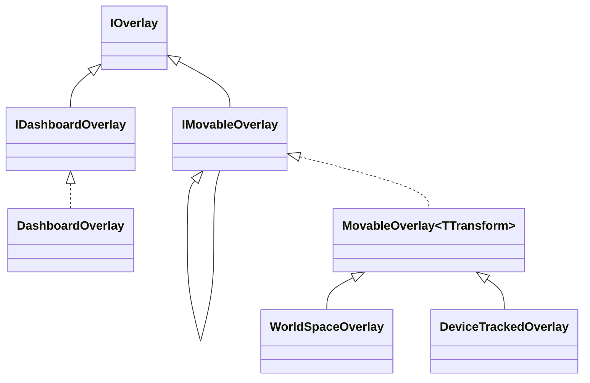

← [Home](Home.md)

# OpenVR インテグレーション

`FloatSoda.OVR` アセンブリは OpenVR API をラップし、型安全なオーバーレイ操作を提供します。

## OVRApplication — OpenVR 初期化

`OVRApplication` クラスはコンストラクタ呼び出し時に `OpenVR.Init()` を実行します。初期化には、検証済みのアプリケーションキーを含む `OVRAppInfo` を渡します。

```csharp
using var app = new OVRApplication(
    new OVRAppInfo(new AppKey("my_overlay_app"), ApplicationType.Overlay));
// app.OVRSystem → CVRSystem（低レベル OpenVR API）
// app.Info.Type → ApplicationType.Overlay
```

`builder.Services.AddFloatSoda()` は `FloatSodaOptions.AppKey` から `OVRAppInfo` を登録します。`host.RunAsync()` でFloatSodaのHostedServiceが開始されると、内部で `OVRApplication` を生成するため、通常は直接インスタンス化する必要はありません。

### ApplicationType

| 値 | 説明 |
|---|---|
| `Overlay` | オーバーレイ専用アプリ（FloatSoda のデフォルト） |
| `Scene` | 3D シーンを描画するアプリ |
| `Background` | SteamVR を起動しないバックグラウンドアプリ |
| `Utility` | ハードウェア不要のユーティリティ（インストーラーなど） |

---

## オーバーレイ種別



| クラス | 位置管理 | `Visibility` | `Transform` |
|---|---|---|---|
| `DashboardOverlay` | SteamVR ダッシュボードが管理 | なし（ダッシュボードに出現） | なし |
| `WorldSpaceOverlay` | ワールド座標で固定 | あり | `WorldOverlayTransform` |
| `DeviceTrackedOverlay` | トラッキングデバイスに追従 | あり | `DeviceTrackedOverlayTransform` |

### DashboardOverlay

```csharp
var identity = new DashboardOverlayIdentity("アプリ名", "ウィンドウ名");
var overlay = new DashboardOverlay(identity);
// overlay.Opacity.Value = 0.9f;
// overlay.WidthInMeters.Value = 1.5f;
```

### WorldSpaceOverlay

```csharp
var identity = new OverlayIdentity("MyApp", "WorldWindow");
var overlay = new WorldSpaceOverlay(identity);

overlay.Visibility.Show();
overlay.Transform.Position = new Vector3(0, 1.5f, -2f);   // メートル単位
overlay.Transform.Rotation = Quaternion.CreateFromYawPitchRoll(0, 0, 0);
```

### DeviceTrackedOverlay

```csharp
var identity = new OverlayIdentity("MyApp", "HandWindow");
var overlay = new DeviceTrackedOverlay(identity);

overlay.Visibility.Show();
overlay.Transform.Target = TrackedDevice.LeftController;
overlay.Transform.Position = new Vector3(0, 0.05f, 0); // コントローラー相対オフセット
```

`TrackedDevice` の値: `LeftController`, `RightController`, `HMD`

---

## オーバーレイプロパティ

すべての `IOverlay` 実装は以下のプロパティ（ケーパビリティオブジェクト）を持ちます。

| プロパティ | 型 | 説明 |
|---|---|---|
| `Opacity` | `OverlayOpacity` | `Value` (0.0–1.0) でアルファを設定 |
| `WidthInMeters` | `OverlayWidthInMeters` | `Value` でワールド幅（メートル）を設定 |
| `Curvature` | `OverlayCurvature` | `Value` で曲率を設定 |
| `Texture` | `OverlayTexture` | `FromTexture_t()` / `FromFile()` でテクスチャを更新 |
| `State` | `OverlayState` | `[VROverlayFlags.X]` でフラグを読み書き |
| `Vibration` | `OverlayVibration` | ハプティックフィードバックを発火 |
| `Input` | `OverlayInput` | 入力方式とホバー状態を管理 |
| `EventDispatcher` | `OverlayEventDispatcher` | そのオーバーレイ固有のイベントを配送 |

派生インターフェース固有のプロパティ:

| 対象 | プロパティ | 説明 |
|---|---|---|
| `IDashboardOverlay` | `Thumbnail` | ダッシュボード用サムネイルテクスチャ |
| `IMovableOverlay` | `Visibility` | `Show()` / `Hide()` で表示状態を管理 |
| `IMovableOverlay` | `Intersection` | レイとオーバーレイ表面の交差判定 |
| `IMovableOverlay` | `Transform` | `Position`, `Rotation` で位置・向きを設定 |

---

## VREventDispatcher

`VREventDispatcher` は `PollEvents()` を呼ぶたびに OpenVR のイベントキューを消費し、登録されたハンドラを呼び出します。抽象クラスであり、用途に応じたサブクラスを使います。

| クラス | 用途 |
|---|---|
| `VRSystemEventDispatcher` | `CVRSystem` から取得するグローバルイベント（`VREvent_Quit` など） |
| `OverlayEventDispatcher` | 特定のオーバーレイ固有のイベント（インタラクション・入力） |

```csharp
var dispatcher = new VRSystemEventDispatcher();

dispatcher.Register(EVREventType.VREvent_Quit, (in VREvent_t _) =>
{
    application.OVRSystem.AcknowledgeQuit_Exiting();
    // 終了処理...
});

// メインループ内で毎フレーム呼ぶ
dispatcher.PollEvents();
```

FloatSodaのHostedServiceは `VREvent_Quit` / `VREvent_ProcessQuit` を自動登録し、受信時にGeneric Host全体へ停止を通知します。

---

## 例外体系

OpenVR API のエラーはすべて型付き例外に変換されます。

| 例外クラス | 発生タイミング |
|---|---|
| `VRInitializeException` | `OVRApplication` 初期化時（SteamVR が起動していないなど） |
| `VROverlayException` | オーバーレイ作成・操作エラー |
| `VRCompositorException` | Compositor 操作エラー |
| `VRInputException` | 入力システムエラー |
| `VRApplicationException` | アプリケーション登録エラー |
| `TrackedPropertyException` | トラッキングプロパティ取得エラー |

`OpenVRExceptionHelper.ThrowIfError()` が各 OpenVR API の戻り値を検査して例外を投げます。ケーパビリティオブジェクト内部で自動的に呼ばれるため、通常は手動で呼ぶ必要はありません。

```csharp
try
{
    using var app = new OVRApplication(
        new OVRAppInfo(new AppKey("my_overlay_app"), ApplicationType.Overlay));
    // ...
}
catch (VRInitializeException ex)
{
    Console.Error.WriteLine($"SteamVR 初期化失敗: {ex.Message}");
}
```

---

## Math — Matrix ヘルパー

`FloatSoda.OVR.Math.Matrix` は `System.Numerics.Matrix4x4` と OpenVR の `HmdMatrix34_t` を相互変換するヘルパーです。

```csharp
// Matrix4x4 → HmdMatrix34_t（OverlayTransform.Apply() 内部で使用）
var hmd = matrix4x4.ToHmdMatrix34_t();
OpenVR.Overlay.SetOverlayTransformAbsolute(handle, origin, ref hmd);
```

`OverlayTransform` サブクラスを実装する場合は `GetMatrix()` が `Position` + `Rotation` から `Matrix4x4` を生成するので、`Apply()` で `ToHmdMatrix34_t()` を呼ぶだけで済みます。

---

## 関連ページ

- [GettingStarted](GettingStarted.md) — オーバーレイ作成の高レベル API(`CreateWindow` と `DashboardWindow` など)
- [Architecture](Architecture.md) — オーバーレイテクスチャへのレンダリング経路
