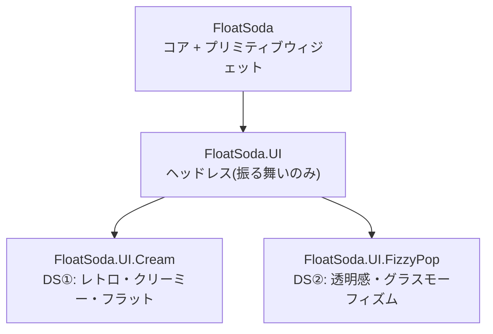

← [Home](Home.md)

# UIレイヤリング(3層パッケージ構成)

FloatSoda の UI 層は、Flutter で起きた「Material ロックイン」(振る舞い層が独立して存在せず、見た目と振る舞いが `material` パッケージに一体化した問題)を避けるため、3層のパッケージに分割されています。



| 層 | パッケージ | 中身 |
|---|---|---|
| プリミティブ | `FloatSoda` | RenderObject を持つウィジェットと、見た目の方針を持たない合成ウィジェット(`SizedBox`, `Flex`, `ColoredBox`, `Text` など) |
| ヘッドレス | `FloatSoda.UI` | 振る舞い・状態機械のみ(`ButtonBase`, `InteractionState`)。見た目は builder デリゲートに完全委譲 |
| デザインシステム | `FloatSoda.UI.Cream` / `FloatSoda.UI.FizzyPop` | ヘッドレスの状態から見た目へのマッピングと `*Style` レコード・テーマ |

デザインシステム同士は互いに参照しません。下位層はすべて見える「緩いレイヤリング」です(デザインシステム層はプリミティブを直接使ってよい)。

---

## 境界基準

- **Skia / レンダーツリーの型に依存するウィジェットはコア**(`FloatSoda`)に置く。`RenderObjectWidget<T>` 系は必然的にコア。
- 見た目の方針(意見)を持たない合成ウィジェット(`Center`, `Container` 予定)もコア。Flutter の `widgets` 層に相当。
- **インタラクションの状態機械(pressed / hovered / focused / disabled など)は必ず `FloatSoda.UI`** に置く。
- 色・余白・角丸などの具体的な見た目はデザインシステム層。

## 2つの規約

1. **振る舞いは必ず FloatSoda.UI に置く。** デザインシステム層の `State` には「ヘッドレスの状態 → 見た目のマッピング」以外のロジックを書かない。Flutter の `TextField` が `material` に振る舞いごと実装され、Cupertino が振る舞いを複製する羽目になった轍を踏まないため。
2. **FloatSoda.UI はデザインシステムの InheritedWidget なしで動作する。** ヘッドレスウィジェットは自前のデフォルトを持ち、`CreamTheme` / `FizzyPopTheme` の存在を前提にしない(Flutter の `Theme.of` / `Material` 祖先の暗黙要求のようなアンビエント依存を作らない)。

**Litmus test:** 「2つ目のデザインシステムが、1つ目のコードをコピーせずに同じコンポーネントを作れるか」。Cream と FizzyPop を最初から並走させているのは、この検証を常時行うためです。ヘッドレス層のAPIに片方のデザインシステム固有の都合が漏れたら、もう片方が壊れることで検知できます。

## 見た目の注入方式

Avalonia のルックレスコントロール(疑似クラス + `PART_` テンプレートパーツ)の契約を、型付きにした形を採用しています:

- 状態の公開 — 文字列の疑似クラスではなく `readonly record struct InteractionState`(型付き)
- 見た目の注入 — 名前ベースの `PART_` 検索ではなく `required Func<IBuildContext, InteractionState, Widget> Builder`(型付きスロット、コンパイル時保証)

```csharp
// ヘッドレス層(FloatSoda.UI): 振る舞いのみ
new ButtonBase
{
    OnPressed = () => ...,
    Builder = (ctx, state) => /* state から見た目を構築 */
};

// デザインシステム層(FloatSoda.UI.Cream): 状態→見た目のマッピングのみ
new Button { Child = new Text("OK"), OnPressed = () => ... };
```

## デザインシステム

| | Cream | FizzyPop |
|---|---|---|
| コンセプト | レトロでクリーミーな色使い、フラットデザイン | 透明感、グラスモーフィズム |
| テーマ | `CreamTheme` | `FizzyPopTheme` |
| 現状 | `Button` スケルトン + `ButtonStyle` | 同構成。背景ブラーは未実装(下記) |

テーマ(`XxxTheme.Of(context)`)はテーマ不在時に null を返し、コンポーネント側が既定スタイルへフォールバックします。テーマが無くても動くことが規約です。

## ロードマップ

主要ヘッドレスUIライブラリ(Radix UI, Headless UI, React Aria, Ark UI, Base UI)の収録コンポーネントを横断調査すると、提供物は2層に分解できる: **Tier 1(分解不能な原始インタラクション)** と、**Tier 2(Tier 1 + Overlay の組み合わせでできる複合コンポーネント)**。この構造をそのままヘッドレス層の実装順に採用する。

### 0. ジェスチャ・ヒットテスト(前提条件)

すべての Tier 1 コンポーネントが依存する基盤。ポインタイベント(press / hover / focus)がここに乗るまで、以下は着手できない。

### 1. Tier 1 — 原始インタラクション

分解不能なインタラクションモデルを1つずつ実装する。各モデルは既存コードとの重複がないことを確認済み:

| 順序 | コンポーネント | インタラクションモデル | 備考 |
|---|---|---|---|
| 1 | `ButtonBase` | 単発アクション(press) | 実装済み(スケルトン) |
| 2 | `ToggleBase` | 二値切替(on/off) | Checkbox・Switch の共通基盤 |
| 3 | `RadioGroupBase` | 排他選択(択一) | Tabs の選択状態管理とも共有可能 |
| 4 | `SliderBase` | 連続値(ドラッグ) | |
| 5 | `TextFieldBase` | 文字入力 | 「振る舞いの一部が見た目」(カーソル・選択ハンドル)になる最難関。builder / スロットで見た目を外注する設計をここでも貫く |
| 6 | `CollapsibleBase` | 開閉(表示・非表示) | Accordion の共通基盤 |

### 2. Overlay / Positioning primitive(Tier 1 と並ぶ独立コンポーネント)

Menu・Select・Combobox・DatePicker・Tooltip・ContextMenu など Tier 2 の大半が同じ Popover 実装を使い回している。HTML/CSS の世界には対応要素がなく、VRオーバーレイでは「アンカー要素に対して浮遊パネルを3D空間にどう配置するか」(画面外にはみ出ない、他ウィンドウと重ならない、視線方向を考慮する)が SteamVR 特有の難問になるため、Web版ヘッドレスUIの実装をそのまま輸入できない。Tier 2 全体をブロックする基盤なので、Tier 1 と並行して早期に着手する。

### 3. Tier 2 — 複合コンポーネント

Tier 1 + Overlay の組み合わせで実装し、状態機械を個別に再発明しない(Litmus test と同じ規律):

| コンポーネント | 組み合わせ元 |
|---|---|
| `SelectBase` / `ComboboxBase` | `TextFieldBase`(検索) + リスト選択 + Overlay |
| `MenuBase` | Overlay + キーボードナビゲーション + `ButtonBase` 群 |
| `AccordionBase` | `CollapsibleBase` × 複数 + 排他制御(`RadioGroupBase` と同じ択一ロジック) |
| `TabsBase` | `RadioGroupBase` の選択状態管理を流用、見た目のみ異なる |

### 4. FizzyPop の完成に必要なレンダー機能

グラスモーフィズムの背景ブラーには `BackdropFilter` 相当(SkiaSharp の `SKImageFilter.CreateBlur` を使うレイヤー / RenderObject)が必要。現状は半透明ベタ塗りまで。Tier 1/2 の実装とは独立して進行可能。

## 関連ページ

- [Architecture](Architecture.md) — アセンブリ構成と3ツリーモデル
- [WidgetSystem](WidgetSystem.md) — 組み込みウィジェット一覧
- [APIDesign](APIDesign.md) — `*Style` レコード分離などのAPI規約
